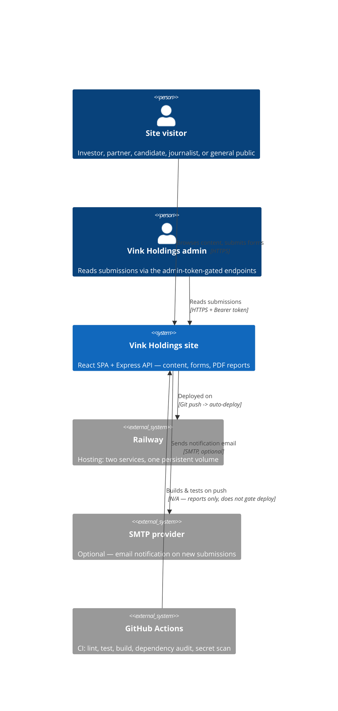
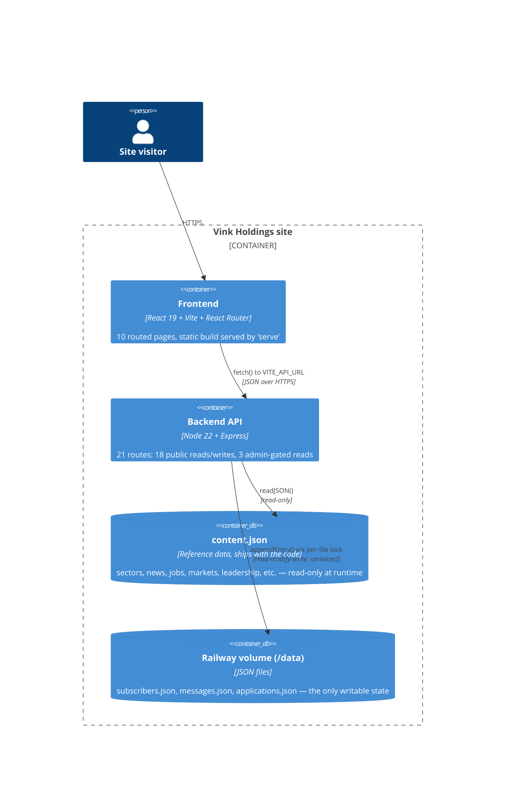

# Architecture

Scope note: this is a corporate marketing/investor-relations site — no user accounts, no money movement,
no complex relational data. The diagrams and models below are sized to that, not padded to look like a
bigger system than it is.

## C4 — Level 1: System Context



## C4 — Level 2: Containers



## Data model

No relational database — three shapes, all flat JSON arrays. This is the actual schema (not aspirational):

**`subscribers.json`** — newsletter
```
{ email: string, subscribedAt: ISO8601 }
```

**`messages.json`** — contact form
```
{ id: int, name: string, email: string, phone: string|null, subject: string, message: string, submittedAt: ISO8601 }
```

**`applications.json`** — job applications
```
{ id: int, jobId: string|null, jobTitle: string, name: string, email: string, phone: string|null, coverNote: string|null, submittedAt: ISO8601 }
```

`content.json` holds the reference data (`company`, `markets`, `sectors`, `stats`, `ads`, `leadership`,
`governance`, `sustainability`, `jobs`, `investorReports`, `news`) — see the file itself for shapes; it's
hand-edited, not user-submitted, so it isn't part of the write path or the threat model below.

**Why no real database yet**: at this traffic level (a handful of form submissions a day, not a day-one
concern), flat JSON-on-a-volume with per-file write locking (see Phase 1) is correct and boring, which is
preferable to Postgres-for-three-tiny-tables complexity. The trigger to migrate isn't a specific number —
it's the first time you need to query across submissions in a way `Array.filter` can't do reasonably, or the
first time you need more than one backend instance running concurrently (the current lock is in-process
memory, not distributed — two backend replicas would each have their own lock and could race each other).

## Migration plan

There's no big-bang rewrite needed — Phase 1 already closed the gap between "current" and "target" for
everything except two items, both deferred by your own call in Phase 0/1:

1. **CI doesn't gate the Railway deploy.** Target: a branch-protection rule requiring the CI workflow to pass
   before merge to `main`, with `main` as the only branch Railway deploys from. Today, pushing straight to
   `main` deploys immediately regardless of CI result. This is a one-time GitHub settings change plus
   agreeing to a PR-based workflow instead of direct pushes — a process change more than a code change,
   which is why I flagged it as a question rather than just doing it.
2. **Single shared admin token vs. real login.** Target, if you ever need it: swap `requireAdmin`'s bearer-token
   check for a real session (even something minimal — one hardcoded admin user, bcrypt-hashed password,
   signed cookie) without touching anything else, since the auth check is already isolated in
   `backend/src/security.js`. No migration risk either way — it's an isolated swap, not a refactor.

Everything else in the original template's Phase 2-7 (mobile completion, KYC, ledger, card tokenization,
maker-checker approvals) doesn't apply — there's no mobile app, no payments, and no money to move.
